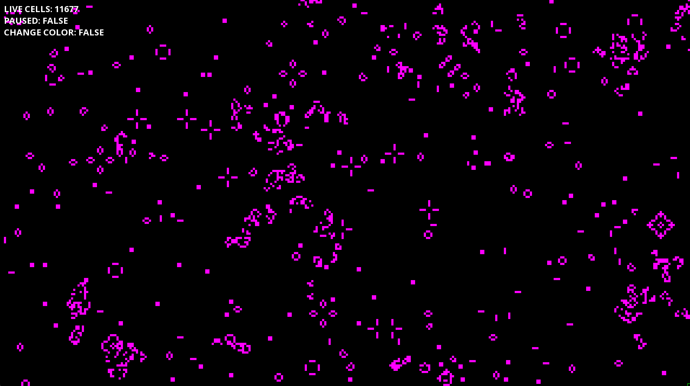
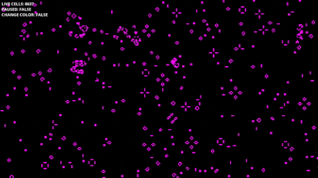

# Conways's Game of Life
Conway's Game of Life is a cellular automata which simulates the population of life following 4 rules

This program uses C++ and the SFML library to visually represent these rules, to produce some interesting results!

## 4 Rules
1.  Any live cell with fewer than two live neighbours dies, as if by underpopulation.
2.  Any live cell with two or three live neighbours lives on to the next generation.
3.  Any live cell with more than three live neighbours dies, as if by overpopulation.
4.  Any dead cell with exactly three live neighbours becomes a live cell, as if by reproduction.

# Controls

> **SPACE** is used to start and stop the simulation
>
> **LEFT CLICK** is used to turn cells alive when the game is paused
>
> **RIGHT CLICK** is used to kill cells when the game is paused
>
> **R** will reset the randomised cells when the game is paused
> 
> **C** will clear the cells entirely when the game is paused
>
> **F** will turn changing colors on / off
>
> **SCROLL WHEEL** will adjust the simulation delay up and down

# IMAGES

# GIFS

